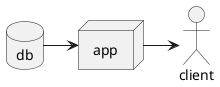
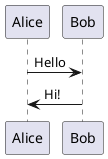

This page will be for sample plantuml diagrams.

I've grown up with graphviz and plantuml.

Mermaid is really simple to integrate, but I've grown used to the features in plantuml and I just can't give them up !

I'm trying to render with:

[kramdown plantuml](https://github.com/SwedbankPay/kramdown-plantuml)
which lets you adds a plugin to `_config.yml`:
```yaml
plugins:
  - "kramdown-plantuml"
```

Which should work at least within a github page.

Let's give it a try.

# sample diagrams
embedding code like:
```
> ```plantuml
> @startuml Diagram
> actor client
> node app
> database db
> db -> app
> app -> client
> @enduml
> ```
```



If that doesn't work, i can put diagrams inside a `<div hidden>` tag with the suggestion from: [noamtamim](https://gist.github.com/noamtamim/f11982b28602bd7e604c233fbe9d910f)

```markdown
> <div hidden>
> ```plantuml
> @startuml firstDiagram
> 
> Alice -> Bob: Hello
> Bob -> Alice: Hi!
> 		
> @enduml
> ```
> </div>
> and display the image with:
> 
```

and manually run:

```bash
plantuml -output ../assets/images -Tsvg _posts/*
```
test locally with:
```bash
bundle exec jekyll serve
```
and launching a browser to `http://127.0.0.1:4000/`

<div hidden>

</div>


